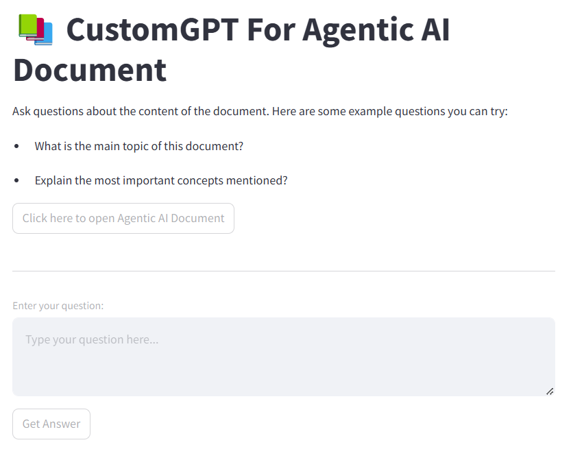

# CustomGPT For Agentic AI Document

This Streamlit application allows users to ask questions about the content of the "Agentic AI" document. The application uses Google Generative AI to generate answers based on the document.

## Features

- Ask questions about the document content
- Get answers generated by Google Generative AI
- View the document directly from the app

## Example Questions

- What is the main topic of this document?
- Explain the most important concepts mentioned?

## Agentic AI CustomGPT



## How to Run

1. Install the required packages:
    ```sh
    pip install -r requirements.txt
    ```

2. Run the Streamlit app:
    ```sh
    streamlit run main.py
    ```

